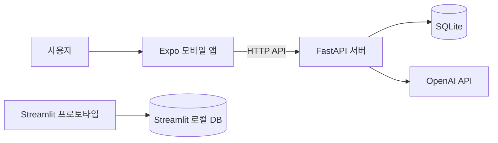

# RoomSync

OpenAI Vision을 활용한 쉐어하우스 공동생활 관리 프로젝트입니다.

RoomSync는 쉐어하우스에서 반복적으로 발생하는 공용비 정산, 청소 일정, 공동 장바구니 관리 문제를 한곳에서 처리하기 위해 개발하고 있습니다.

현재 저장소에는 다음 세 가지가 함께 포함되어 있습니다.

- 초기 기능 검증용 Streamlit 웹 프로토타입
- React Native·Expo 기반 모바일 앱
- 모바일 앱과 연결되는 FastAPI 백엔드

---

## 프로젝트 배경

쉐어하우스에서는 공용 물품 구매 내역이나 청소 일정 등을 카카오톡, 메신저, 메모장으로 관리하는 경우가 많습니다.

이 방식은 간단하지만 다음과 같은 문제가 발생할 수 있습니다.

- 영수증의 품목과 금액을 직접 입력해야 함
- 누가 얼마를 내야 하는지 확인하기 어려움
- 정산 완료 여부를 지속적으로 추적하기 어려움
- 청소 일정과 담당자가 대화 내용에 묻힘
- 필요한 공용 물품을 중복으로 구매할 수 있음
- 하우스 구성원별 정보를 일관되게 관리하기 어려움

RoomSync는 이러한 정보를 하우스 단위로 저장하고, 구성원들이 같은 데이터를 함께 확인할 수 있도록 설계했습니다.

---

## 주요 기능

### 사용자 및 하우스 관리

- 회원가입 및 로그인
- 로그인 상태 유지
- 하우스 생성
- 초대코드를 통한 하우스 참여
- 하우스 구성원 목록 조회
- owner와 일반 멤버 구분
- 하우스 변경
- 하우스 나가기
- 소유권 이전
- 하우스 삭제
- 계정 삭제

### 영수증 분석

- 휴대폰 사진 보관함에서 영수증 이미지 선택
- FastAPI 서버로 이미지 업로드
- OpenAI Vision을 이용한 영수증 분석
- 품목명, 수량, 가격, 총액 추출
- 분석 결과 수정
- 정산 대상 구성원 선택
- 개발 환경을 위한 mock 분석 모드

### 정산 관리

- 실제 하우스 구성원 기준 정산 대상 선택
- 선택한 구성원 간 1/N 정산
- 정산 내역 DB 저장
- 진행 중 정산과 완료 정산 구분
- 구성원별 부담 금액 확인
- 생성자 또는 하우스 owner의 정산 삭제
- 삭제된 정산은 DB에 기록을 남기는 soft delete 방식 사용

### 청소 일정

- 청소 일정 등록
- 청소 항목, 담당자, 예정일 설정
- 현재 하우스 구성원만 담당자로 선택
- 일정 수정
- 완료 및 미완료 상태 변경
- 일정 삭제

### 공동 장바구니

- 공동 물품 추가
- 구매 완료 처리
- 완료 상태 해제
- 완료 품목 개별 삭제
- 완료 품목 일괄 정리
- 현재 하우스 구성원끼리 목록 공유

---

## 현재 구현 상태

| 기능 | 상태 | 비고 |
|---|---|---|
| 회원가입, 로그인, 로그아웃 | 구현 | 로그인 상태 유지 포함 |
| 하우스 생성 | 구현 | 생성자를 owner로 자동 등록 |
| 초대코드 참여 | 구현 | 중복 참여 방지 |
| 하우스 구성원 조회 | 구현 | 실제 DB 멤버 조회 |
| 영수증 이미지 선택 | 구현 | 현재 사진 보관함에서 선택 |
| OpenAI 영수증 분석 | 구현 | 품목과 금액 추출 |
| 분석 결과 수정 | 구현 | 분석 후 사용자 확인 가능 |
| 품목별 공용·개인 선택 | 보완 중 | 모바일 화면에서 세부 기능 추가 예정 |
| 1/N 정산 | 구현 | 실제 하우스 구성원 기준 |
| 정산 조회 및 삭제 | 구현 | 생성자 또는 owner 권한 확인 |
| 참여자 납부 상태 변경 | 예정 | DB 구조와 수정 UI 추가 필요 |
| 청소 일정 관리 | 구현 | 생성, 수정, 완료, 삭제 |
| 공동 장바구니 | 구현 | 추가, 완료, 삭제 |
| 하우스 나가기 | 구현 | owner는 바로 나갈 수 없음 |
| 소유권 이전 | 구현 | 현재 하우스 멤버에게 이전 |
| 하우스 삭제 | 구현 | owner만 가능 |
| 계정 삭제 | 구현 | 소유 하우스 상태 확인 후 처리 |
| 카메라 직접 촬영 | 예정 | 현재 사진 보관함만 지원 |
| 알림 설정 | 일부 구현 | UI 중심, 서버 연동 예정 |
| 언어 설정 | 일부 구현 | UI 중심, 서버 연동 예정 |

기능 상태는 현재 저장소의 개발 버전을 기준으로 작성했습니다. 실제 동작 여부는 브랜치와 커밋 시점에 따라 달라질 수 있습니다.

---

## 전체 구조



### Streamlit

프로젝트 초기 단계에서 화면 흐름과 핵심 기능을 빠르게 확인하기 위해 만든 웹 프로토타입입니다.

루트의 다음 파일을 사용합니다.

```text
app.py
database.py
requirements.txt
```

### Expo 모바일 앱

React Native와 Expo Router를 이용해 만든 모바일 앱입니다.

주요 화면은 다음과 같습니다.

- 로그인 및 회원가입
- 하우스 선택 및 생성
- 홈
- 정산
- 청소
- 공동 장바구니
- 설정 및 하우스 관리

### FastAPI 백엔드

모바일 앱에서 사용하는 API 서버입니다.

다음 기능을 담당합니다.

- 사용자 인증
- 하우스 권한 확인
- SQLite 데이터 저장 및 조회
- 초대코드 처리
- 영수증 이미지 업로드
- OpenAI API 호출
- 정산, 청소, 장바구니 CRUD
- 하우스 및 계정 삭제 처리

모바일 앱은 SQLite 파일이나 Python 코드에 직접 접근하지 않고 FastAPI를 통해서만 데이터를 요청합니다.

---

## 프로젝트 구조

```text
roomsync/
├─ app.py
├─ database.py
├─ requirements.txt
├─ sample_receipts/
│
├─ frontend/
│  ├─ app/
│  ├─ assets/
│  ├─ components/
│  ├─ constants/
│  ├─ contexts/
│  ├─ hooks/
│  ├─ services/
│  ├─ types/
│  ├─ package.json
│  └─ app.json
│
├─ backend/
│  ├─ app/
│  ├─ data/
│  ├─ scripts/
│  ├─ tests/
│  ├─ requirements.txt
│  └─ .env.example
│
├─ docs/
├─ .gitignore
└─ README.md
```

---

## 사용 기술

### 모바일

- React Native
- Expo SDK 54
- Expo Router
- TypeScript
- Expo Go

### 백엔드

- Python
- FastAPI
- Uvicorn
- Pydantic

### 데이터베이스

- SQLite

### AI

- OpenAI API
- 기본 영수증 분석 모델: `gpt-4.1-mini`

### 웹 프로토타입

- Streamlit
- Pandas

### 협업

- GitHub
- GitHub Desktop
- Feature Branch
- Pull Request

---

## 실행 전 준비

다음 프로그램이 필요합니다.

- Git
- Node.js LTS
- Python 3.11 이상
- VSCode
- iPhone 또는 Android의 Expo Go
- OpenAI 영수증 분석을 사용할 경우 OpenAI API 키

아래 명령은 Windows PowerShell 기준입니다.

---

## 모바일 앱 환경변수 설정

`frontend/.env.example`을 복사해 `frontend/.env.local`을 만듭니다.

```powershell
Copy-Item frontend/.env.example frontend/.env.local
```

`frontend/.env.local`에는 FastAPI 서버 주소를 입력합니다.

```env
EXPO_PUBLIC_API_URL=http://YOUR_PC_IP:8001
```

예시:

```env
EXPO_PUBLIC_API_URL=http://10.5.50.21:8001
```

실제 iPhone에서 실행할 때는 `localhost` 또는 `127.0.0.1`을 사용할 수 없습니다.

노트북의 IP는 다음 명령으로 확인할 수 있습니다.

```powershell
ipconfig
```

`무선 LAN 어댑터 Wi-Fi` 항목의 IPv4 주소를 사용합니다.

`frontend/.env.local`은 개인 PC의 IP가 포함될 수 있으므로 GitHub에 올리지 않습니다.

---

## 백엔드 환경변수 설정

`backend/.env.example`을 복사해 `backend/.env`를 만듭니다.

```powershell
Copy-Item backend/.env.example backend/.env
```

예시:

```env
ROOMSYNC_DB_PATH=backend/data/roomsync.db
ROOMSYNC_CORS_ORIGINS=*
ROOMSYNC_RECEIPT_MODE=auto
ROOMSYNC_RECEIPT_MOCK_ENABLED=false
ROOMSYNC_RECEIPT_MODEL=gpt-4.1-mini
OPENAI_API_KEY=YOUR_OPENAI_API_KEY
```

### 영수증 분석 모드

실제 OpenAI API를 사용할 경우:

```env
ROOMSYNC_RECEIPT_MODE=auto
ROOMSYNC_RECEIPT_MOCK_ENABLED=false
OPENAI_API_KEY=실제_API_키
```

개발용 mock 분석을 사용할 경우:

```env
ROOMSYNC_RECEIPT_MODE=mock
ROOMSYNC_RECEIPT_MOCK_ENABLED=true
```

OpenAI API 키는 반드시 `backend/.env`에만 입력합니다.

다음 위치에는 입력하지 않습니다.

```text
frontend/.env.local
app.py
GitHub README
소스 코드
```

---

## Streamlit 실행 방법

프로젝트 루트에서 가상환경을 생성합니다.

```powershell
python -m venv .venv-streamlit
```

패키지를 설치합니다.

```powershell
.venv-streamlit\Scripts\python.exe -m pip install -r requirements.txt
```

Streamlit 앱을 실행합니다.

```powershell
.venv-streamlit\Scripts\python.exe -m streamlit run app.py
```

첫 실행 시 로컬 DB가 생성될 수 있습니다.

---

## FastAPI 실행 방법

백엔드 가상환경을 생성합니다.

```powershell
python -m venv backend\.venv
```

패키지를 설치합니다.

```powershell
backend\.venv\Scripts\python.exe -m pip install -r backend\requirements.txt
```

DB 스키마를 준비합니다.

```powershell
backend\.venv\Scripts\python.exe -m backend.scripts.prepare_database
```

FastAPI 서버를 실행합니다.

```powershell
backend\.venv\Scripts\python.exe -m uvicorn backend.app.main:app --host 0.0.0.0 --port 8001 --reload
```

다음 문구가 나타나면 정상적으로 실행된 상태입니다.

```text
Uvicorn running on http://0.0.0.0:8001
Application startup complete.
```

---

## API 문서 확인

FastAPI 서버 실행 후 노트북 브라우저에서 다음 주소로 접속합니다.

```text
http://127.0.0.1:8001/docs
```

Swagger 화면에서 실제 API 경로와 요청 형식을 확인할 수 있습니다.

주요 API는 다음과 같습니다.

```text
/auth/signup
/auth/login
/auth/me
/auth/logout

/houses
/houses/join
/houses/{house_id}
/houses/{house_id}/members

/houses/{house_id}/receipts/analyze
/houses/{house_id}/settlements
/houses/{house_id}/chores
/houses/{house_id}/shopping-items
```

세부 요청 방식은 `/docs`에 표시되는 현재 OpenAPI 내용을 기준으로 확인합니다.

---

## Expo Go 실행 방법

FastAPI 서버를 먼저 실행합니다.

새 터미널에서 `frontend` 폴더로 이동합니다.

```powershell
cd frontend
```

패키지를 설치합니다.

```powershell
npm install
```

Expo 개발 서버를 실행합니다.

```powershell
npx expo start --clear
```

터미널에 표시되는 QR 코드를 iPhone 카메라 또는 Expo Go에서 스캔합니다.

### 연결할 때 확인할 사항

- 노트북과 휴대폰이 같은 네트워크에 연결되어 있어야 합니다.
- 학교나 공용 Wi-Fi에서는 기기 간 접속이 차단될 수 있습니다.
- 환경변수를 수정한 경우 Expo 서버를 다시 실행해야 합니다.
- FastAPI 터미널과 Expo 터미널을 동시에 켜둬야 합니다.
- `--tunnel` 방식은 네트워크에 따라 연결이 불안정할 수 있습니다.

Expo Go는 개발과 시연을 위한 도구입니다. 실제 설치형 앱이나 App Store 배포에는 EAS Build 또는 TestFlight 설정이 별도로 필요합니다.

---

## 앱 기본 사용 흐름

1. 회원가입 또는 로그인
2. 새 하우스 생성 또는 초대코드 입력
3. 사용할 하우스 선택
4. 영수증 이미지 선택
5. OpenAI 영수증 분석
6. 분석된 품목과 금액 확인
7. 정산 대상 하우스 멤버 선택
8. 1/N 정산 저장
9. 정산 내역 확인
10. 청소 일정과 공동 장바구니 관리
11. 설정 화면에서 구성원과 초대코드 확인

---

## 두 계정으로 시연하는 방법

1. 사용자 A가 회원가입합니다.
2. 사용자 A가 새 하우스를 생성합니다.
3. 설정 화면에서 초대코드를 확인합니다.
4. 사용자 A가 로그아웃합니다.
5. 사용자 B가 다른 이메일로 회원가입합니다.
6. 하우스 선택 화면에서 초대코드를 입력합니다.
7. 사용자 B가 같은 하우스에 참여합니다.
8. 구성원 목록에서 A와 B가 모두 표시되는지 확인합니다.
9. 한 계정에서 청소 일정이나 장바구니 항목을 등록합니다.
10. 다른 계정에서 같은 데이터가 조회되는지 확인합니다.

발표용 계정의 이메일과 비밀번호는 README나 공개 GitHub 저장소에 작성하지 않습니다.

---

## 팀원별 담당

| 팀원 | 담당 내용 |
|---|---|
| 류승범 | 프로젝트 구조 정리, Expo 앱 통합, 인증 및 하우스 기능, GitHub 관리 |
| 김규성 | SQLite 테이블 구조, FastAPI CRUD, 하우스 및 계정 관련 DB 처리 |
| 권정균 | 영수증 이미지 업로드, OpenAI Vision 분석, JSON 결과 검증 |
| 장서현 | 공용 품목 계산, 1/N 정산 로직, 정산 기능 테스트 |
| 장수경 | 청소 일정, 공동 장바구니, 완료 및 삭제 기능 |

담당 범위는 개발 진행 과정에서 일부 조정될 수 있습니다.

---

## Git 브랜치 사용 방법

`main` 브랜치에 바로 작업하지 않고 기능별 브랜치를 사용합니다.

```powershell
git switch main
git pull --ff-only
git switch -c feature/작업명
```

브랜치 예시:

```text
feature/auth-house
feature/database-api
feature/receipt-vision
feature/settlement
feature/chores-shopping
```

작업이 끝나면 다음 순서로 진행합니다.

1. 변경 파일 확인
2. 담당 브랜치에 commit
3. GitHub에 push
4. Pull Request 생성
5. 다른 팀원 확인
6. `main` 브랜치에 병합

커밋 전에는 반드시 `.env`, DB, API 키가 포함되지 않았는지 확인합니다.

---

## 검사 명령

### 모바일 프론트엔드

```powershell
cd frontend
npm run lint
npx tsc --noEmit
```

### FastAPI 백엔드

프로젝트 루트에서 실행합니다.

```powershell
backend\.venv\Scripts\python.exe -m unittest discover -s backend\tests
```

FastAPI import 확인:

```powershell
backend\.venv\Scripts\python.exe -c "from backend.app.main import app; print(app.title)"
```

### Streamlit

```powershell
.venv-streamlit\Scripts\python.exe -m py_compile app.py database.py
```

---

## GitHub에 올리지 않는 파일

다음 파일과 폴더는 GitHub에 올리지 않습니다.

```text
.env
.env.local
backend/.env
frontend/.env.local

node_modules/
frontend/node_modules/
.expo/
frontend/.expo/

venv/
.venv/
backend/.venv/

__pycache__/
*.pyc

sharemate.db
backend/data/*.db
DB 백업 파일

실제 영수증 이미지
실제 사용자 정보
OpenAI API 키
개인 PC IP 주소
세션 토큰
```

커밋 전에 다음 명령으로 포함 파일을 확인합니다.

```powershell
git status --short
git diff --cached
```

---

## 남은 작업

현재 개발 과정에서 남아 있는 주요 작업은 다음과 같습니다.

- 영수증 품목별 공용·개인 선택
- 품목별 정산 참여자 지정
- 참여자별 납부 상태 변경
- 모든 참여자 납부 완료 시 정산 자동 완료
- 카메라 직접 촬영
- 알림 설정 서버 연동
- 언어 설정 서버 연동
- 비밀번호 재설정
- 이메일 인증
- 운영용 데이터베이스 적용
- HTTPS 적용
- 인증 토큰 보안 강화
- 네트워크 오류 재시도 처리
- TestFlight 또는 EAS Build 배포
- 접근성 및 오프라인 동작 테스트

---

## 참고

이 저장소는 캡스톤 프로젝트의 개발 과정과 기능 구현 내용을 교수님과 팀원들이 확인할 수 있도록 정리한 저장소입니다.

현재는 기능 구현과 시연을 우선하고 있으며, 실제 서비스로 배포하기 전에는 개인정보 처리, 운영용 DB, HTTPS, 인증 정책과 보안 설정을 추가로 점검해야 합니다.
