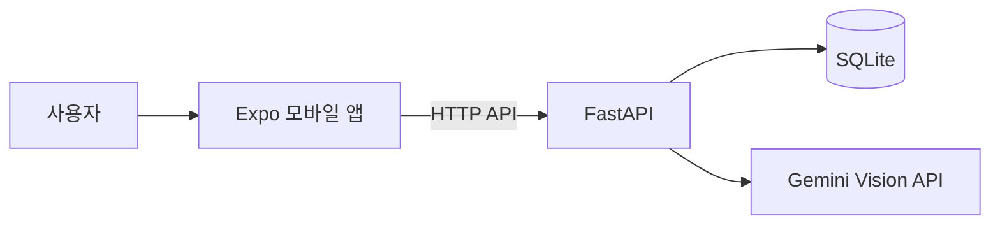

# RoomSync

> AI 영수증 분석 기반 쉐어하우스 공동생활 관리 플랫폼

RoomSync는 쉐어하우스에서 반복되는 영수증 정산, 청소 일정, 공동 장보기 관리를 하나의 모바일 앱으로 통합한 프로젝트입니다. 영수증 이미지를 Gemini Vision으로 분석하고, 사용자가 품목과 금액을 검증한 뒤 참여자별 분담금을 센트 단위로 계산합니다.

## 핵심 기능

- 회원가입, 로그인 및 하우스별 권한 관리
- 초대 코드 기반 하우스 참여와 멤버 관리
- 영수증 이미지 업로드 및 Gemini Vision 분석
- 품목별 공용/개인 항목 지정과 참여자 선택
- 호주 GST 포함 여부와 프로모션 할인 검증
- 센트 단위 분담금 계산 및 납부 상태 관리
- 청소 일정 등록, 담당자 지정 및 완료 처리
- 공동 장보기 항목 등록 및 구매 상태 공유

## 기술 스택

| 영역 | 기술 |
|---|---|
| 모바일 | React Native, Expo SDK 54, Expo Router, TypeScript |
| 백엔드 | Python, FastAPI, Uvicorn, Pydantic |
| 데이터베이스 | SQLite |
| AI | Google Gemini Vision, OpenAI 선택 지원 |
| 테스트 | pytest, Expo ESLint, TypeScript |

## 시스템 구조



```text
roomsync/
├─ frontend/              Expo 모바일 앱
│  ├─ app/                화면 및 Expo Router 경로
│  ├─ components/         공통 UI 컴포넌트
│  ├─ services/           FastAPI 통신
│  └─ utils/              정산 및 금액 계산
├─ backend/               FastAPI 서버
│  ├─ app/                API, DB, 스키마, 영수증 분석
│  ├─ scripts/            DB 준비 스크립트
│  └─ tests/              백엔드 테스트
├─ app.py                 초기 Streamlit 프로토타입
├─ database.py            프로토타입 DB 코드
└─ sample_receipts/       테스트용 영수증
```

## 빠른 실행 방법

### 1. 사전 준비

- Git
- Node.js LTS 및 npm
- Python 3.11 이상
- 스마트폰의 Expo Go 앱
- 실제 AI 분석 시 Gemini API 키

저장소를 받은 뒤 프로젝트 루트에서 아래 명령을 실행합니다.

```powershell
git clone https://github.com/ryusb2295/roomsync.git
cd roomsync
```

비공개 저장소이므로 접근 권한이 있는 GitHub 계정이 필요합니다.

### 2. 백엔드 설정 및 실행

```powershell
python -m venv backend\.venv
backend\.venv\Scripts\python.exe -m pip install -r backend\requirements.txt
Copy-Item backend\.env.example backend\.env
```

`backend/.env`에서 영수증 분석 방식을 설정합니다.

실제 Gemini 분석:

```env
ROOMSYNC_RECEIPT_PROVIDER=gemini
GEMINI_API_KEY=발급받은_API_키
ROOMSYNC_GEMINI_MODEL=gemini-3.1-flash-lite
ROOMSYNC_RECEIPT_MOCK_ENABLED=false
```

API 키 없이 기능을 확인하는 mock 모드:

```env
ROOMSYNC_RECEIPT_PROVIDER=mock
ROOMSYNC_RECEIPT_MOCK_ENABLED=true
```

DB를 준비하고 서버를 실행합니다.

```powershell
backend\.venv\Scripts\python.exe -m backend.scripts.prepare_database
backend\.venv\Scripts\python.exe -m uvicorn backend.app.main:app --host 0.0.0.0 --port 8001 --reload
```

정상 실행 확인:

- 상태 확인: <http://127.0.0.1:8001/health>
- Swagger API 문서: <http://127.0.0.1:8001/docs>

### 3. 모바일 앱 설정 및 실행

스마트폰과 백엔드를 실행하는 PC를 같은 Wi-Fi에 연결합니다. PowerShell에서 PC의 IPv4 주소를 확인합니다.

```powershell
ipconfig
```

프런트엔드 환경 파일을 생성합니다.

```powershell
Copy-Item frontend\.env.example frontend\.env.local
```

`frontend/.env.local`의 주소를 PC의 IPv4 주소로 변경합니다. 스마트폰에서 실행할 때 `localhost`를 사용하면 안 됩니다.

```env
EXPO_PUBLIC_API_URL=http://YOUR_PC_IP:8001
EXPO_PUBLIC_ROOMSYNC_DEMO_MODE=false
```

새 PowerShell 창에서 앱을 실행합니다.

```powershell
cd frontend
npm install
npx expo start -c
```

터미널에 표시된 QR 코드를 Expo Go로 스캔합니다.

## 실행 문제 해결

- `Network request failed`: 스마트폰과 PC가 같은 Wi-Fi인지, `EXPO_PUBLIC_API_URL`의 IP와 포트가 정확한지 확인합니다.
- API 주소 변경이 반영되지 않음: `npx expo start -c`로 Expo 캐시를 초기화합니다.
- Windows 방화벽 경고: Python과 Node.js의 사설 네트워크 통신을 허용합니다.
- 학교 또는 공용 Wi-Fi 연결 실패: 기기 간 통신이 차단될 수 있으므로 개인 핫스팟을 사용합니다.
- AI 분석 실패: `backend/.env`의 provider, API 키, 모델명을 확인합니다. 기능 시연만 필요하면 mock 모드를 사용합니다.

## 기본 사용 흐름

1. 회원가입 또는 로그인
2. 하우스 생성 또는 초대 코드로 참여
3. 영수증 이미지 업로드
4. AI가 추출한 매장, 품목, GST 및 할인 결과 확인
5. 잘못 인식된 항목 수정 및 참여자 선택
6. 개인별 분담금 확정
7. 정산 내역과 납부 상태 확인
8. 청소 일정과 공동 장보기 관리

## 검증 방법

백엔드 테스트:

```powershell
backend\.venv\Scripts\python.exe -m pytest backend\tests -q
```

프런트엔드 정적 검사:

```powershell
cd frontend
npm run lint
npx tsc --noEmit
```

## 현재 한계와 향후 계획

- 현재 FastAPI와 SQLite는 로컬 환경에서 실행됩니다.
- 스마트폰과 PC가 같은 네트워크에 있어야 합니다.
- 영수증 형식과 촬영 품질에 따라 AI 결과가 달라질 수 있어 사용자 검증 단계를 제공합니다.
- 실제 송금과 푸시 알림은 아직 연동하지 않았습니다.

향후 FastAPI 클라우드 배포, PostgreSQL 전환, 실시간 동기화, 푸시 알림, 송금 서비스 연계를 계획하고 있습니다.

## 팀원 역할

| 팀원 | 담당 |
|---|---|
| 류승범 | 조장, 백엔드, Gemini, 데이터베이스, 최종 통합 |
| 김규성 | QA, 테스트, 문서화 |
| 권정균 | 프런트 구조, 인증, 하우스, API 연결 |
| 장서현 | 영수증 결과, 참여자 선택, 정산 UI |
| 장수경 | 청소 일정, 공동 장보기 |

## 보안 및 저장소 주의사항

다음 파일과 데이터는 GitHub에 올리지 않습니다.

- `backend/.env`, `frontend/.env.local` 및 실제 API 키
- SQLite 실행 DB와 백업 파일
- 실제 사용자의 개인정보 및 영수증 이미지
- 인증 토큰과 개인 PC의 고정 IP 설정

이 저장소는 교육 프로그램 최종 프로젝트 결과물입니다.
