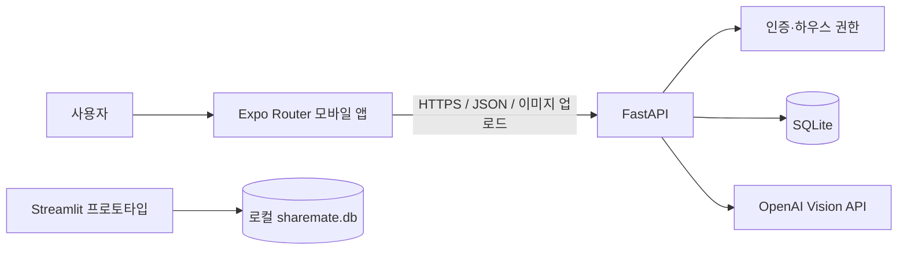

# RoomSync

OpenAI Vision 기반 쉐어하우스 생활 관리 플랫폼

RoomSync는 여러 사람이 함께 사는 집에서 반복적으로 발생하는 영수증 정산, 청소 일정, 공동 장바구니와 멤버 관리를 하나의 모바일 흐름으로 묶는 프로젝트입니다. 저장소에는 초기 검증용 Streamlit 프로토타입, Expo 모바일 앱, FastAPI 백엔드가 함께 들어 있습니다.

## 1. 프로젝트 소개

쉐어하우스 구성원은 공동 지출을 메신저로 공유하고, 청소 당번과 필요한 물품을 서로 다른 채널에서 관리하는 경우가 많습니다. RoomSync는 하우스 단위로 사용자를 연결하고 생활 데이터를 함께 조회·수정하도록 설계했습니다.

## 2. 개발 배경과 문제 정의

- 영수증을 보고 품목과 금액을 다시 입력해야 합니다.
- 누가 어느 하우스의 멤버인지 일관되게 관리하기 어렵습니다.
- 정산, 청소, 장바구니의 상태가 대화방에 흩어집니다.
- 테스트용 이름과 mock 데이터가 실제 사용자 데이터처럼 보이면 신뢰성이 떨어집니다.
- 모바일 앱이 SQLite나 Python 코드에 직접 접근하면 보안과 배포가 어려워집니다.

RoomSync 모바일 앱은 FastAPI HTTP API만 사용하며, OpenAI API 키와 SQLite 접근은 백엔드에만 둡니다.

## 3. 주요 기능과 구현 상태

| 기능 | 상태 | 설명 |
|---|---|---|
| 회원가입·로그인·로그아웃 | 구현 완료 | 비밀번호 PBKDF2 해시, Bearer 세션, SecureStore 로그인 유지 |
| 하우스 생성 | 구현 완료 | 생성자를 owner로 자동 등록하고 고유 초대코드 발급 |
| 초대코드 참여 | 구현 완료 | 실제 DB 멤버십 저장, 중복 참여 방지 |
| 하우스 구성원 관리 | 구현 완료 | 현재 하우스의 실제 멤버 조회, owner 역할 구분 |
| 영수증 이미지 선택 | 구현 완료 | iPhone 사진 보관함 선택과 미리보기 |
| OpenAI Vision 영수증 분석 | 구현 완료 | 품목명·수량·금액·총액 분석, 결과 수정 가능 |
| 공용 품목 선택 | 부분 구현 | 모바일은 분석 품목 전체 금액을 정산에 사용합니다. 품목별 공용/개인 선택은 후속 과제입니다. |
| 1/N 정산 | 구현 완료 | 실제 하우스 멤버 선택 후 균등 분배하여 DB 저장 |
| 정산 조회·삭제 | 구현 완료 | 참여자별 금액 조회, 생성자/owner soft delete |
| 납부 상태 변경 | 예정 | 참여자별 `payment_status`는 저장되지만 변경 UI/API는 아직 없습니다. |
| 청소 일정 | 구현 완료 | 생성·조회·수정·완료/취소·삭제, 담당자 멤버 검증 |
| 공동 장바구니 | 구현 완료 | 추가·조회·구매 완료·개별 삭제·완료 항목 일괄 삭제 |
| 하우스 나가기·소유권 이전·삭제 | 구현 완료 | 역할/소유권 검증과 transaction 적용 |
| 계정 삭제 | 구현 완료 | 공유 하우스 owner 차단, 세션 폐기, 사용자 익명화 |
| 카메라 직접 촬영 | 예정 | 현재는 사진 보관함 선택만 지원합니다. |
| 알림·언어 변경 | 부분 구현 | 설정 UI만 있으며 서버 동기화는 아직 없습니다. |

## 4. Streamlit, Expo, FastAPI의 관계

- **Streamlit**: 초기 아이디어와 데이터 흐름을 검증한 웹 프로토타입입니다. 루트 `app.py`, `database.py`를 사용합니다.
- **Expo**: 실제 사용자를 위한 iOS/Android 모바일 UI입니다. SQLite나 Python 파일에 직접 접근하지 않습니다.
- **FastAPI**: 인증, 권한, DB transaction, OpenAI Vision 호출을 담당합니다.



Streamlit DB와 FastAPI 작업 DB는 기본적으로 분리됩니다. `*.db`는 Git에 포함하지 않습니다.

## 5. 프로젝트 구조

```text
roomsync/
├─ app.py                    # Streamlit 프로토타입
├─ database.py               # Streamlit SQLite 함수
├─ requirements.txt          # Streamlit 의존성
├─ sample_receipts/          # 공개 가능한 샘플 영수증 위치
├─ frontend/                 # React Native + Expo Router
│  ├─ app/                   # 파일 기반 라우트
│  ├─ components/            # 공통 UI
│  ├─ constants/             # 테마와 API 설정
│  ├─ contexts/              # 인증/현재 하우스 상태
│  ├─ services/              # HTTP API 클라이언트
│  └─ types/                 # TypeScript API 타입
├─ backend/                  # FastAPI 서버
│  ├─ app/                   # API, DB, 보안, 영수증 분석
│  ├─ scripts/               # 빈 DB 준비/마이그레이션
│  ├─ tests/                 # API 및 DB 테스트
│  └─ data/                  # 로컬 DB 위치(DB는 Git 제외)
└─ docs/                     # 발표자료, 보고서, ERD, API 문서
```

## 6. 기술 스택

- Mobile: React Native 0.81, Expo SDK 54, Expo Router 6, TypeScript strict
- Backend: Python, FastAPI, Pydantic, Uvicorn
- Database: SQLite
- AI: OpenAI Python SDK, Vision 입력을 지원하는 모델
- Prototype: Streamlit, Pandas
- Test: Python `unittest`, HTTPX ASGI transport, ESLint, TypeScript

## 7. 설치 전 준비 프로그램

- Git
- Node.js LTS와 npm
- Python 3.11 이상 권장
- iPhone의 Expo Go(개발·시연 시)
- 선택 사항: OpenAI API 키

Windows PowerShell을 기준으로 아래 명령을 작성했습니다.

## 8. Frontend 환경변수

```powershell
Copy-Item frontend/.env.example frontend/.env.local
```

`frontend/.env.local`:

```env
EXPO_PUBLIC_API_URL=http://YOUR_PC_IP:8001
```

`YOUR_PC_IP`는 iPhone과 같은 Wi-Fi에서 접근 가능한 PC의 IPv4 주소로 바꿉니다. `localhost`는 실제 iPhone 자신을 가리키므로 사용할 수 없습니다. `.env.local`은 커밋하지 않습니다.

## 9. Backend 환경변수와 OpenAI 키

```powershell
Copy-Item backend/.env.example backend/.env
```

```env
ROOMSYNC_DB_PATH=backend/data/roomsync.db
ROOMSYNC_CORS_ORIGINS=*
ROOMSYNC_RECEIPT_MODE=auto
ROOMSYNC_RECEIPT_MOCK_ENABLED=false
ROOMSYNC_RECEIPT_MODEL=gpt-4.1-mini
OPENAI_API_KEY=YOUR_OPENAI_API_KEY
```

- API 키는 `backend/.env`에만 둡니다.
- `auto` 모드는 키가 있으면 OpenAI를 사용합니다.
- 실제 OpenAI 요청 없이 다른 기능을 개발할 수 있습니다.
- 명시적인 mock 영수증 분석은 `ROOMSYNC_RECEIPT_MODE=mock`과 `ROOMSYNC_RECEIPT_MOCK_ENABLED=true`를 함께 설정해야 합니다.

## 10. Streamlit 실행

```powershell
python -m venv .venv-streamlit
.venv-streamlit/Scripts/python -m pip install -r requirements.txt
.venv-streamlit/Scripts/python -m streamlit run app.py
```

첫 실행 시 로컬 `sharemate.db`가 생성될 수 있으며 Git에서 제외됩니다. OpenAI 기능을 사용하려면 루트 `.env`에 키를 설정합니다.

## 11. FastAPI 설치와 실행

```powershell
python -m venv backend/.venv
backend/.venv/Scripts/python -m pip install -r backend/requirements.txt
backend/.venv/Scripts/python -m backend.scripts.prepare_database
backend/.venv/Scripts/python -m uvicorn backend.app.main:app --host 0.0.0.0 --port 8001 --reload
```

`prepare_database`는 공개 저장소에 원본 DB가 없어도 빈 스키마를 생성하고 모든 마이그레이션을 적용합니다.

## 12. Expo Go 실행

```powershell
Set-Location frontend
npm install
npx expo start --clear
```

1. FastAPI를 먼저 `0.0.0.0:8001`에서 실행합니다.
2. PC와 iPhone을 같은 Wi-Fi에 연결합니다.
3. Expo Go에서 터미널 QR 코드를 스캔합니다.
4. 환경변수를 바꿨다면 Expo 개발 서버를 다시 시작합니다.

Expo Go는 개발·시연용입니다. 실제 배포에는 EAS Build, 앱 서명, HTTPS API, 운영 비밀 관리와 배포 환경 구성이 추가로 필요합니다.

## 13. API 문서

서버 실행 후 다음 주소에서 Swagger UI를 확인합니다.

- PC: `http://127.0.0.1:8001/docs`
- OpenAPI JSON: `http://127.0.0.1:8001/openapi.json`

주요 API:

- Auth: `/auth/signup`, `/auth/login`, `/auth/me`, `/auth/logout`
- Houses: `/houses`, `/houses/join`, `/houses/{house_id}/members`
- Receipt: `/houses/{house_id}/receipts/analyze`
- Settlements: `/houses/{house_id}/settlements`
- Chores: `/houses/{house_id}/chores`
- Shopping: `/houses/{house_id}/shopping-items`

세부 메서드와 요청 모델은 `/docs`의 실제 OpenAPI 정의를 기준으로 합니다.

## 14. 앱 기본 사용 흐름

1. 회원가입 또는 로그인
2. 새 하우스 생성 또는 초대코드 참여
3. 사용할 하우스 선택
4. 영수증 이미지 선택 및 AI 분석
5. 분석 품목명과 금액 확인/수정
6. 실제 하우스 멤버 중 정산 대상자 선택
7. 1/N 정산 저장 및 내역 확인
8. 청소 일정과 공동 장바구니 관리
9. 설정에서 멤버·초대코드·하우스 권한 관리

## 15. 두 계정으로 데이터 공유 시연

1. 사용자 A가 회원가입 후 `House A`를 생성합니다.
2. 설정에서 초대코드를 복사합니다.
3. A가 로그아웃합니다.
4. 사용자 B가 다른 이메일로 회원가입합니다.
5. 하우스 선택 화면에서 초대코드를 입력합니다.
6. B가 `House A`에 참여하고 멤버 목록에서 A와 B를 확인합니다.
7. 한 계정에서 청소 일정, 장바구니 품목 또는 정산을 생성합니다.
8. 다른 계정으로 로그인해 같은 하우스 데이터를 확인합니다.

실제 이메일과 비밀번호는 발표자료, 이슈, 커밋 또는 공개 DB에 넣지 않습니다.

## 16. 팀원별 역할

실제 담당자 이름은 팀에서 확정한 뒤 아래 표를 갱신하세요. 저장소에는 임의의 개인 이름을 넣지 않습니다.

| 역할 | 담당자 | 주요 업무 |
|---|---|---|
| Mobile | 확정 필요 | Expo UI, 상태 관리, iPhone 검증 |
| Backend | 확정 필요 | FastAPI, 인증, 권한, SQLite |
| AI/Receipt | 확정 필요 | Vision 프롬프트, 분석 검증 |
| QA/Docs | 확정 필요 | 테스트, 발표자료, README, 시연 |

## 17. Git 브랜치와 Pull Request 협업

```powershell
git switch main
git pull --ff-only
git switch -c feature/short-description
```

- 기능별 브랜치를 사용합니다: `feature/*`, `fix/*`, `docs/*`.
- 한 PR에는 한 목적의 변경만 포함합니다.
- PR 전에 frontend lint/TypeScript와 backend 테스트를 실행합니다.
- 최소 한 명의 리뷰 후 main에 병합합니다.
- DB, 비밀값, 개인 IP가 diff에 없는지 반드시 확인합니다.

## 18. 검사 명령

```powershell
# Frontend
Set-Location frontend
npm run lint
npx tsc --noEmit

# Backend (저장소 루트에서)
backend/.venv/Scripts/python -m unittest discover -s backend/tests

# FastAPI import
backend/.venv/Scripts/python -c "from backend.app.main import app; print(app.title)"

# Streamlit 구문/import
.venv-streamlit/Scripts/python -m py_compile app.py database.py
```

Backend 테스트는 임시 SQLite DB를 사용하며 실제 OpenAI 요청을 보내지 않습니다.

## 19. GitHub에 올리면 안 되는 파일

- `.env`, `.env.local`, `backend/.env`, `frontend/.env.local`
- OpenAI API 키와 모든 서비스 비밀값
- 개인 PC IP 주소
- `node_modules/`, `.expo/`, `.venv/`, `venv/`, `__pycache__/`
- `sharemate.db`, `backend/data/*.db`, DB 백업
- 실제 사용자 이메일, 이름, 비밀번호, 세션 토큰
- 실제 영수증과 업로드 이미지
- IDE/OS 캐시와 로그

커밋 전 `git status --short`와 `git diff --cached`를 확인하세요.

## 20. 현재 구현 상태와 남은 과제

현재 모바일 앱은 인증, 하우스 공유, 영수증 분석, 정산 저장/삭제, 청소, 장바구니, 하우스/계정 관리의 실제 API 흐름을 제공합니다. 테스트는 임시 DB를 사용해 하우스 격리와 권한을 검증합니다.

남은 주요 과제:

- 영수증 품목별 공용/개인 선택과 품목별 참여자 지정
- 참여자 납부 상태 변경과 정산 완료 자동 판정
- 카메라 직접 촬영
- 알림과 언어 설정의 서버 연동
- 비밀번호 재설정과 이메일 검증
- 운영용 PostgreSQL, HTTPS, 토큰 정책, rate limit
- EAS Build 및 App Store/TestFlight 배포
- 접근성·오프라인·네트워크 재시도 테스트

## 21. 라이선스와 데이터 주의

라이선스는 팀 정책에 따라 별도로 확정해야 합니다. 샘플 데이터는 익명·합성 데이터만 사용하고, 실제 영수증이나 사용자 DB를 저장소에 커밋하지 마세요.

